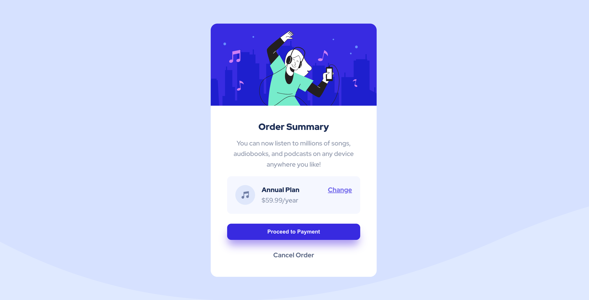
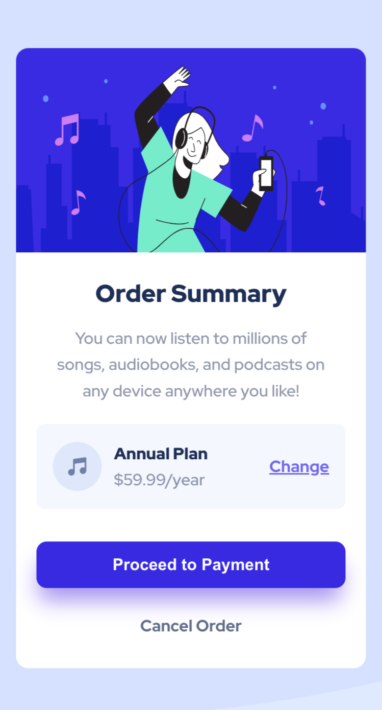

# Frontend Mentor - Order-summary-component

This is a solution to the [Order summary card challenge on Frontend Mentor](https://www.frontendmentor.io/challenges/order-summary-component-QlPmajDUj). Frontend Mentor challenges help you improve your coding skills by building realistic projects. 

## Table of contents

- [Overview](#overview)
  - [The challenge](#the-challenge)
  - [Screenshot](#screenshot)
  - [Links](#links)
- [My process](#my-process)
  - [Built with](#built-with)
  - [What I learned](#what-i-learned)
  - [Continued development](#continued-development)
  - [Useful resources](#useful-resources)
- [Author](#author)
- [Acknowledgments](#acknowledgments)

## Overview
This is my sixth Frontend Mentor challenge. The task is undertaken with an intent to improve my frontend development skills as a junior frontend developer.

### The challenge

Users should be able to:

- View the optimal layout for the component depending on their device's screen size

### Screenshot

### Links

- Live Site URL: [Add live site URL here](https://duokobia.github.io///)

## My process

A sketch was used to approximate dimensions and how to set up the flex layout. Remote git repository was created for the project before development commenced.

### Built with

- Semantic HTML5 markup
- CSS custom properties
- Flexbox
- CSS Grid
- Desktop-first approach 

### What I learned

Using utility classes in the HTML, as in Tailwind approach, was fun. With this approach, I had to almost rewrite the stylesheet for media queries. I could not make mobile screens inherit the desktop properties easily. Achieving this for me is easier when I use CSS Grid for the container. I could not use clamp() property to make banner responsive across a wide range of screen sizes as expected.

Despite the struggles, I still found this project interesting. I am eager to improve my frontend development skills by working on more projects in order to write cleaner and more efficient codes. 

I will appreciate and welcome all suggestions please.

### Continued development

- use clamp() for responsiveness of banners. 
- better naming convention used for future projects such as BEM.
- Media query with advanced website layouts.
- writing cleaner, scalable and easy to maintain code.
- use common frameworks such as Tailwind and Bootstrap for future projects.

### Useful resources

- Frontend Mentor website and slack community
- google
- stackoverflow
- youtube videos
- w3schools.com
- css-tricks.com
- developer.mozilla.org

## Author

- Frontend Mentor - [@duokobia](https://www.frontendmentor.io/profile/duokobia)

## Acknowledgments

- Frontend Mentor community
- Stakeoverflow community
- Youtube content creators

